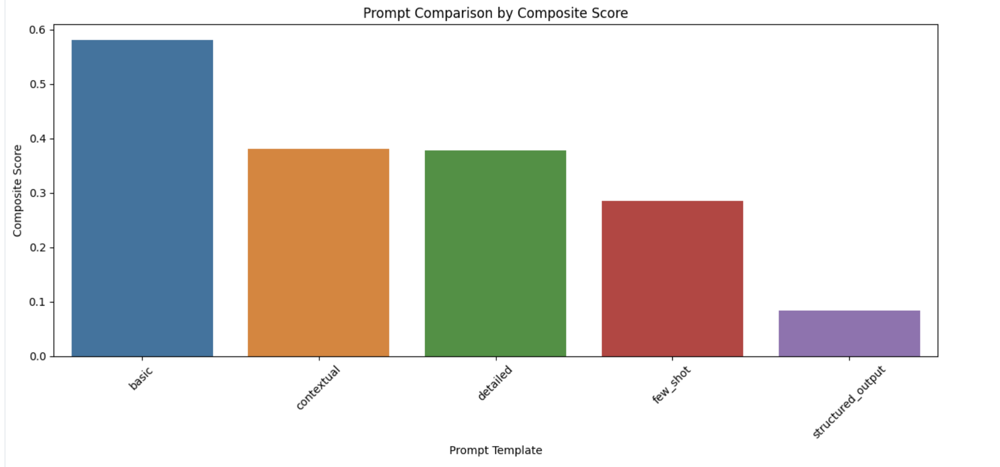

# 🚀 LLM-Based Recommendation System: Prompt Evaluation on Databricks

This repository provides a **Databricks notebook** for **evaluating and optimizing LLM prompt templates** in a recommendation system. It enables **data scientists and engineers** to experiment with multiple prompts, track performance metrics using **MLflow**, and visualize prompt effectiveness.

## 📌 Features
- ✅ **Multi-Prompt Evaluation**: Test different LLM prompt styles for recommendations.
- ✅ **MLflow Logging & Experimentation**: Track performance across multiple prompt runs.
- ✅ **Key Metrics**: Analyze **response time, relevance, diversity, genre match, and format compliance**.
- ✅ **Supports Any LLM Model**: Works with **Databricks-hosted LLMs, OpenAI API, or custom endpoints**.
- ✅ **Visualization**: Compare prompt effectiveness using plots and MLflow UI.

---

## 📂 Repository Structure
```
├── recommendation-system-prompt-evaluation.ipynb  # Main Databricks notebook
├── images/                                        # (Optional) Stores performance visualizations
│   ├── prompt_comparison.png
│   ├── radar_comparison.png
├── README.md                                      # Documentation
```

---

## ⚙️ How to Use This Notebook on Databricks

### 1️⃣ **Import Notebook to Databricks**
Instead of cloning this repo manually, you can import the notebook directly into Databricks:

1. Open **Databricks Workspace**.
2. Navigate to the **Workspace** tab.
3. Click on **`Import`** at the top-right.
4. Select **`File`**, then upload `recommendation-system-prompt-evaluation.ipynb`.
5. Attach the notebook to a cluster with **MLflow enabled**.

### 2️⃣ **Install Dependencies**
The notebook requires **Databricks MLflow, OpenAI, Pandas, Scikit-learn, Sentence Transformers, and Matplotlib**.
If any package is missing, install them using:
```python
%pip install mlflow pandas scikit-learn sentence-transformers openai matplotlib seaborn
```

### 3️⃣ **Run the Notebook**
- Execute all cells to evaluate different LLM prompt templates.
- MLflow will log results automatically.

---

## 🎯 How It Works
### 🏗 **Step 1: Define Multiple Prompt Templates**
The notebook includes **several prompt styles**, including:
- **Basic** (Simple Recommendations)
- **Structured Output** (JSON format)
- **Contextual** (Dynamic User Preferences)
- **Few-Shot Examples** (Pre-Trained Patterns)

### 📊 **Step 2: Generate Recommendations**
Each prompt is passed to an LLM (e.g., OpenAI GPT, Databricks Llama 3), and the response is logged.

### 📈 **Step 3: Evaluate Performance**
Metrics like **relevance score, diversity score, response time**, and **format compliance** are calculated.

### 🔍 **Step 4: Log & Compare with MLflow**
All evaluations are **tracked in MLflow**, making it easy to compare performance across multiple prompt templates.

---

## 📌 Example Prompt Evaluation
```python
evaluate_prompt_performance(
    prompt_name="structured_output",
    prompt_template=structured_prompt,
    user=user_sample,
    catalog_items=movie_catalog,
    model_source="databricks-meta-llama-3-3-70b-instruct"
)
```
MLflow will log:
✅ **Response Time**  
✅ **Relevance Score**  
✅ **Diversity Score**  
✅ **Format Compliance**  

---

## 📊 Visualization Examples
**Comparison of prompt performance using radar plots and bar charts:**


---

## 🚀 Best Practices for LLM-Based Recommendation Engines
1. **Use embeddings for retrieval**: Combine **vector search + LLMs** for best results.
2. **Track and version prompts**: Store different prompt styles and compare effectiveness.
3. **Optimize for response time**: Reduce token size and pre-filter candidates before passing to LLM.
4. **Leverage MLflow**: Log experiments to compare **LLM models, prompt styles, and system performance**.

---

## 📜 License
This project is licensed under the **MIT License**.

---

## 🤝 Contributing
Contributions are welcome! Feel free to:
- Open an issue 📌
- Submit a pull request 🚀
- Share feedback in discussions 💡

---

## 📬 Contact
For questions or suggestions, reach out via **[GitHub Issues](#)** or email at **debusinha2009@gmail.com**.
